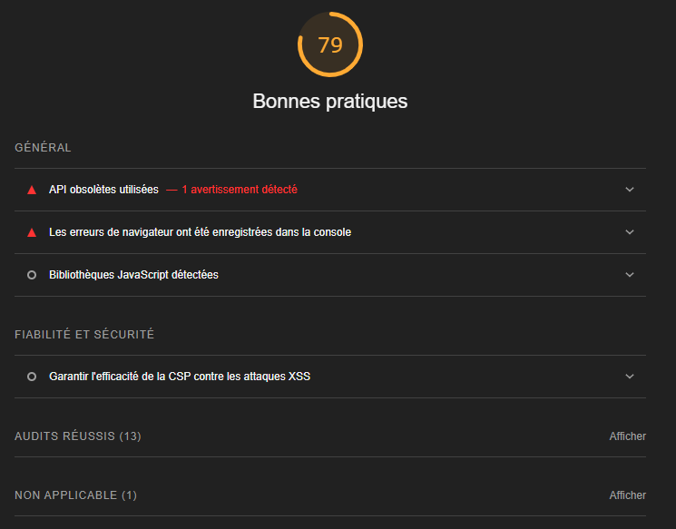

# Validation du site web

## Sommaire

- [Validation du site web](#validation-du-site-web)
  - [Sommaire](#sommaire)
  - [Validation W3C](#validation-w3c)
    - [Validation HTML](#validation-html)
    - [Validation CSS](#validation-css)
  - [Validation Lighthouse](#validation-lighthouse)
    - [Rapports complets](#rapports-complets)
    - [Résultats Lighthouse](#résultats-lighthouse)
  - [Navigation dans la documentation](#navigation-dans-la-documentation)

## Validation W3C

### Validation HTML

### Validation CSS

## Validation Lighthouse

### Rapports complets

- [Rapport Lighthouse Mobile](./reports/rapport-ligthouse_cv-online_mobile.pdf)
- [Rapport Lighthouse Desktop](./reports/rapport-ligthouse_cv-online_desktop.pdf)

### Résultats Lighthouse

| **Critère**       | **Desktop** | **Mobile** |
|-------------------|-------------|------------|
| **Synthèse**      |  |  |
| **Performance**   |  |  |
| **Accessibilité** |  |  |
| **Bonnes pratiques** |  |  |
| **SEO**           |  |  |

## Navigation dans la documentation

Pour plus d'informations sur le projet, vous pouvez consulter les documents suivants :

- [README du repository GitHub](../../README.md) : Vue d'ensemble du projet, instructions d'installation et d'utilisation, méthodes de développement.
- [README du projet CV Online](./README_Project.md) : Détails sur l'architecture, les fonctionnalités, les instructions d'utilisation, les dépendances, la configuration, les tests et le déploiement de l'application CV Online.
- [Preuves de validation](./VALIDATION_PRODUCT.md) : Résultats des validations W3C et Lighthouse.
